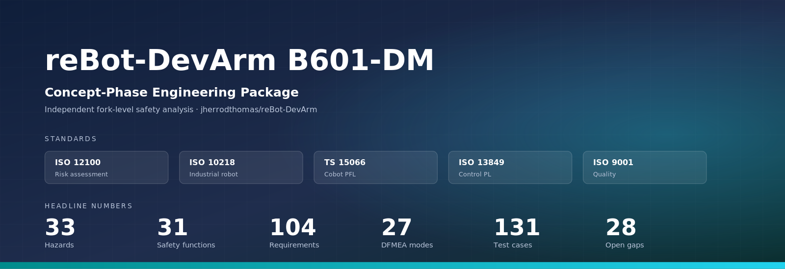
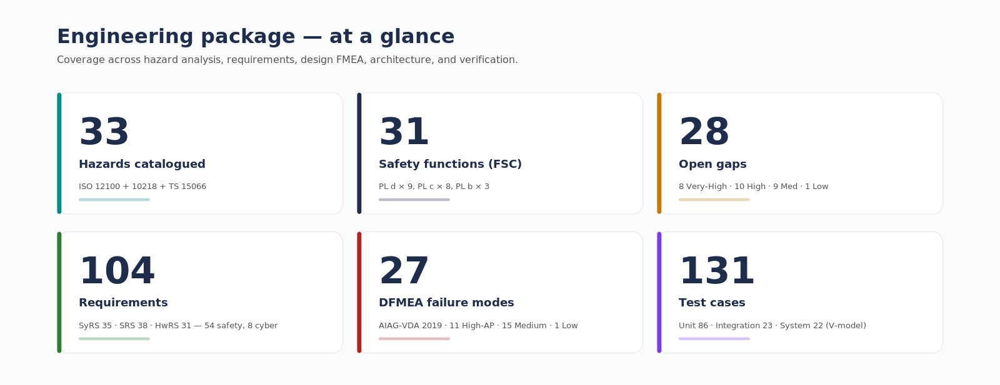
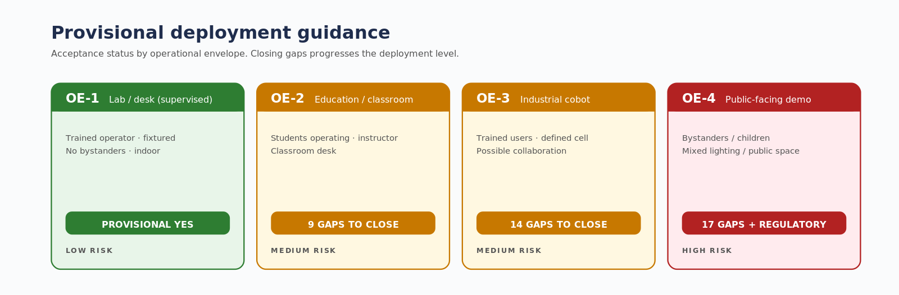

# 🦾 reBot-DevArm: Open Source Robotic Arm for All Developers

  

    <!-- Replaced with CC BY-NC-SA 4.0 badge, explicitly indicating non-commercial use -->
    
    
    
    
    

  <strong>🚀 100% Open Source · Embodied AI · Full Hardware + Software Stack</strong>

  <strong>📦 Build your own robotic arm · 🧠 Learn robotics · 🏭 Deploy real applications</strong>

<table align="center">
  <tr>
    <td>
      
    </td>
    <td>
      <a href="https://www.youtube.com/watch?v=ONbpv3seiG8">
        About The reBot Arm
      </a>
    </td>
  </tr>
</table>

  <strong>
    <a href="./README_zh.md">简体中文</a> &nbsp;|&nbsp;
    <a href="./README.md">English</a> &nbsp;|&nbsp;
    <a href="./README_JP.md">日本語</a>&nbsp;|&nbsp;
    <a href="./README_Fr.md">français</a>&nbsp;|&nbsp;
    <a href="./README_es.md">Español</a>
  </strong>

<a href="https://wiki.seeedstudio.com/robotics_page/">  
    </a>

## 📖 Introduction

**reBot-DevArm (reBot Arm B601 DM and reBot Arm B601 RS)** is a robotic arm project dedicated to lowering the barrier to learning Embodied AI. We focus on **"True Open Source"** — not just the code, we unreservedly open source everything:
- 🦾 **Two versions of the robotic arm**：We will provide all open-source files for two versions of the robotic arm with the same appearance: **Robostride** and **Damiao**.
- 🛠️ **Hardware Blueprints**: Source files for sheet metal parts and 3D printed parts.
- 🔩 **BOM List**: Detailed down to the specifications and purchase links for every single screw.
- 💻 **Software & Algorithms**: Python SDK, ROS1/2, Isaac Sim, LeRobot, etc.

## Get Your Own reBot Arm

- We offer five kit options  at  [Seeedstudio.com](https://www.seeedstudio.com/reBot-Arm-B601-DM-Bundle.html) :
  - **Arm Body Motor Kit**: Includes only motors and wiring harnesses for the robotic arm.
  - **Arm Body Structural Kit**: Includes only mechanical structural components.
  - **Gripper Complete Kit**: Includes motors, wiring harnesses and structural components for the gripper.
  - **Full Kit**: Includes the complete set of the robotic arm body and gripper.
  - **Pre‑assembled Robotic Arm**: Fully assembled finished robotic arm.

- You can also purchase the [Leader Arm](https://www.seeedstudio.com/Star-Arm-102-p-6765.html?qid=P2U7IG_yskyak5m_1776415593315)

## 🗺️ Roadmap & Status

We are committed to continuously maintaining and adapting to mainstream robot development ecosystems. Below is our current adaptation progress and planned release schedule:

### reBot Arm B601 DM
| Supported Ecosystem | Status | Description / Estimated Release Date | Related Documentation |
| :--- | :---: | :--- | :--- |
| **Basic Motor Usage** | ✅ Completed | Basic motion control and API encapsulation | [Damiao Technology](https://wiki.seeedstudio.com/cn/damiao_series/) |
| **Open-Sourcing of the New STEP 3D Structural Parts and BOM** | ✅ Completed | STEP files for all parts in the new version, parts BOM, and reference prices for all machined components | [reBot Arm B601-DM BOM](./hardware/reBot_B601_DM/readme.md) |
| **Reference for Real Machine Performance Testing** | ✅ Completed   | Performance Reference of Robotic Arm under Normal and Extreme Operating Conditions |[Performance Testing](./hardware/reBot_B601_DM/performance_testing/Performance_Testing.md) |
| **Assembly Video** | ✅ Completed | Ultra-detailed assembly steps and video | [Getting Started with reBot Arm B601-DM](https://wiki.seeedstudio.com/rebot_b601_dm_getting_started/) |
| **ROS2 (Humble)** | 🚧 In Progress  | Core drivers have been completed, and MoveIt2 is currently being optimized | [Expected: 2026.04.20] |
| **Python SDK** | ✅Continuously optimized, PRs welcome | One-stop integration of motor read/write and control for Robstride, Damiao, Mota, Gaoqing, Hexfellow and other motors. | [Getting Started with Motorbridge](https://motorbridge.seeedstudio.com) and [Web UI](https://rebot-devarm.w0x7ce.eu/)|
| **Pinocchio Integration** |  ✅ Completed  | Adaptation to the Pinocchio framework, enabling forward/inverse kinematics and gravity compensation for the robotic arm | [Getting Started with Pinocchio for reBot Arm B601-DM](https://wiki.seeedstudio.com/rebot_arm_b601_dm_pinocchio_meshcat/) and [Github repo](https://github.com/vectorBH6/reBotArm_control_py) |
| **Isaac Sim Simulation** | 🚧 In Progress  | Import USD models and enable simulated teleoperation | [Expected: 2026.04.20] |
| **LeRobot Integration** | ✅ Completed  | Adaptation to the Hugging Face LeRobot training framework | [Getting Started with LeRobot-based reBot Arm](https://wiki.seeedstudio.com/rebot_arm_b601_dm_lerobot/) |
| **Depth Camera Integration** | ✅ Completed  | Visual Grasping Demonstration Based on YOLO and Depth Camera | [Getting Started with Visual Grasping Demo](https://wiki.seeedstudio.com/rebot_arm_b601_dm_grasping_demo/) |
| **Gradual Updates of the Latest Algorithms** | ⏳ Planned | Mainstream algorithms will be updated progressively | Ongoing |
| **Launch of a Series of Completely Free Courses** | ⏳ Planned | Mainstream algorithms will be updated progressively | Ongoing |

### reBot Arm B601 RS

| Supported Ecosystem | Status | Description / Estimated Release Date | Related Documentation |
| :--- | :---: | :--- | :--- |
| **Basic Motor Usage** | ✅ Completed | Basic motion control and API encapsulation | [Robstride](https://wiki.seeedstudio.com/cn/robstride_control/) |
| **Open-Sourcing of the New STEP 3D Structural Parts and BOM** | 🚧 In Progress | STEP files for all parts in the new version, parts BOM, and reference prices for all machined components | Expected [2026.05] |
| **Assembly Video** | 🚧 In Progress | Ultra-detailed assembly steps and video | [Expected 2026.05] |
| **ROS2 (Humble)** | ⏳ Planned | Core drivers have been completed, and MoveIt2 is currently being optimized | [Expected 2026.05] |
| **LeRobot Integration** | ⏳ Planned | Adaptation to the Hugging Face LeRobot training framework | [Expected 2026.05] |
| **Pinocchio Integration** | ⏳ Planned | Adaptation to the Pinocchio framework, enabling forward/inverse kinematics and gravity compensation for the robotic arm | [Expected 2026.05] |
| **Isaac Sim Simulation** | ⏳ Planned | Import USD models and enable simulated teleoperation | [Expected 2026.05] |
| **Gradual Updates of the Latest Algorithms** | ⏳ Planned | Mainstream algorithms will be updated progressively | Ongoing |
| **Launch of a Series of Completely Free Courses** | ⏳ Planned | Mainstream algorithms will be updated progressively | Ongoing |

---

## ⚙️ Hardware Specifications

reBot-DevArm is designed for desktop Embodied AI applications, balancing payload capacity with flexibility.

| Parameter | reBot Arm B601-DM |
| :--- | :--- |
| **Recommended Continuous Payload** | Less than 1.5 kg within 70% of arm reach workspace |
| **Recommended Payload** | **1.5 kg** |
| **Max Reach** | **650 mm** |
| **Weight** | Approx. 4.5 kg |
| **Repeatability** | < 0.2 mm |
| **Degrees of Freedom (DOF)** | 6 DOF + 1 Gripper (Open source CAN servo gripper and joint motor gripper coming soon) |
| **Supported Platforms/Ecosystems** | ROS1, ROS2, LeRobot, Pinocchio, Isaac Sim, Python SDK |
| **Supply Voltage** | DC 24V |

## 🧹Optional Hardware
###  Wirst Camera Mount
| 32×32 UVC  | Intel D435i | Intel D405 & Gemini 305 | Gemini 2|
| --- | --- | --- | --- | 
|  |  |   |  | 
| [STEP](/hardware/reBot_B601_DM/3D_Printed_Parts/UVC32_mount.step) | [STEP](/hardware/reBot_B601_DM/3D_Printed_Parts/D435_Gemini2_Mount.step) | [STEP](/hardware/reBot_B601_DM/3D_Printed_Parts/D405_305_Mount.step) |[STEP](/hardware/reBot_B601_DM/3D_Printed_Parts/D435_Gemini2_Mount.step) |

###  Compatible with Leader Arm
| Star Arm 102-LD  |  Open to compatibility integration  | 
| --- | --- |
|    |Comming soon| 
|  [Github repo](https://github.com/servodevelop/Star-Arm-102) |Comming soon |

### DIY Finger
| Soft Finger  |  Open to compatibility integration  | 
| --- | --- |
|    |Comming soon| 
| [Finger Mount(ABS/PLA)](/hardware/reBot_B601_DM/3D_Printed_Parts/Soft_Gripper_Mount.step) and [Finger (TPU 95+)](/hardware/reBot_B601_DM/3D_Printed_Parts/Soft_Gripper_Finger.step)  |Coming soon |

---

### 🎓 Full-Stack Robotics Ecosystem
reBot-DevArm is not just a robotic arm, but a robotics learning community. We share the following general tutorials for free:

#### 🖥️ Edge Computing & Master Control
*    —— **AI Inference & Compute Core**
*    —— **General Linux Development Environment**
*   [-0091BD?style=for-the-badge&logo=espressif&logoColor=white)](https://wiki.seeedstudio.com/SeeedStudio_XIAO_Series_Introduction/) —— **Low-power Wireless Control Node**

#### 📡 Sensors & Peripherals
*   **🚗 Motors & Servos**: [Damiao / Gogo / Robstride / Mita / Feite / Fashion Star](https://wiki.seeedstudio.com/robotics_page/)
*   **👁️ Visual Perception**: [Depth Cameras / LiDAR / Vision Algorithms](https://wiki.seeedstudio.com/robotics_page/)
*   **👂 Auditory Interaction**: [ReSpeaker Mic Arrays / Speech Recognition](https://wiki.seeedstudio.com/ReSpeaker_Mic_Array_v2.0/)
*   **🧭 Motion & Attitude**: [IMU (6-axis/9-axis) / Gyroscopes / Magnetometers](https://wiki.seeedstudio.com/Sensor/IMU/)
*   **🤖 Comprehensive Kits**: [More Robotics Sensors & Driver Examples](https://wiki.seeedstudio.com/robotics_page/)

> 👉 **[Click to Enter Wiki Knowledge Base](https://wiki.seeedstudio.com/)** (All tutorials are free to view)

---

## 🙌 References & Acknowledgments
The path of open source is never lonely. The birth of the reBot-DevArm project would not be possible without the full support of Seeed Studio, the global open source community, and excellent hardware partners. We pay our highest respects to the following projects and teams:

### 🌍 Ecosystem & Software Support
*   **[Seeed Studio](https://www.seeedstudio.com/)** - Providing comprehensive hardware supply chain and technical support.
*   **[Hugging Face LeRobot](https://github.com/huggingface/lerobot)** - An excellent end-to-end robot learning framework.
*   **[NVIDIA Isaac Sim](https://developer.nvidia.com/isaac/sim)** - A powerful robot simulation and synthetic data platform.

### ⚙️ Core Hardware Partners
Thanks to the following manufacturers for providing high-performance motor and actuator solutions:
*   **[Damiao Technology](https://www.damiaokeji.com/)**
*   **[Robstride](https://robstride.com/)**
*   **[Fashion Star](https://fashionstar.com.hk/wiki/)**

### 💡 Inspiration
This project is deeply inspired by the following excellent open source projects:
*   **[SO-ARM100](https://github.com/TheRobotStudio/SO-ARM100/tree/main)**
*   **[Mobile ALOHA](https://github.com/tonyzhaozh/aloha)**
*   **[Dummy-Robot (Zhihui Jun)](https://github.com/peng-zhihui/Dummy-Robot)**
*   **[OpenArm](https://openarm.dev/)**
*   **[I2RT](https://i2rt.com/)**
*   **[TRLC-DK1](https://github.com/robot-learning-co/trlc-dk1)**

### 🎃 Prototype Contributors
- **SeeedStudio AI Robotics Team's**: Yaohui Zhu (yaohui.zhu@seeed.cc)
- **SeeedStudio STU**: Wentao Dong
- **SeeedStudio STU**: Weiwei Xu
- **SeeedStudio Purchasing Department**: Fengqun Peng

### 👥 Contributors

## Our Top Contributors 

*Coming soon... Welcome to submit PRs to become a contributor!*

## Star History

# reBot-DevArm Project License
Copyright (c) [2025] [Seeed Studio]

This work is licensed under the **Creative Commons Attribution-NonCommercial-ShareAlike 4.0 International License**.
To view a copy of this license, visit: http://creativecommons.org/licenses/by-nc-sa/4.0/

--------------------------------------------------------------------------------

## Rights and Restrictions Statement

The core purpose of this open-source project is to promote knowledge sharing and enable developers and enthusiasts to access and learn cutting-edge robotic arm technologies at minimal cost. We provide completely free and publicly available documentation and video tutorials to help users get started quickly, conduct in-depth research, and jointly promote the popularization and practical application of robotics.

### I. Non-Commercial Use Policy

All open-source content of this project is fully available for personal learning, research, and non-commercial use. Individual users are allowed to:

* View and study the project’s open-source documentation, code, and tutorials;
* Modify and debug the open-source content for personal learning and research purposes;

### II. Commercial Use Policy

We actively encourage and support developers, robotics enthusiasts, and third-party platforms to carry out secondary development based on the reBot robotic arm and promote real-world applications. The following outlines permitted and prohibited commercial activities:

#### (1) Permitted Commercial Activities

We respect every developer’s efforts and legitimate earnings.Including but not limited to:

* Developing application-oriented software systems and promoting or selling them commercially;
* Creating structured educational courses (online/offline) and offering paid training or knowledge services;
* Conducting offline education, training, and technology outreach activities worldwide;
* Other commercial activities that contribute to the open-source community, knowledge dissemination, and real-world application of robotics technology.

For the above compliant commercial activities, you are welcome to contact us. We will provide free commercial authorization, implementation support, and promotional assistance. We may also publicly announce your authorization to help your project succeed.

#### (2) Prohibited Commercial Activities

It is prohibited to make minor modifications to this project’s product, replace IP, logos, or related identifiers, and sell it under a self-owned brand. Such actions do not constitute substantial technical innovation and do not benefit developer growth, the open-source community, or the project itself. These behaviors are considered violations, and we reserve the right to take action.

### III. Collaboration & Contact

We hope to collaborate with all developers and partners within a compliant framework to promote the maturity and deployment of the reBot robotic arm project. For individuals and organizations interested in bringing real-world robotic applications to life, we offer:

* Commercial licensing and intellectual property compliance support;
* Assistance in promoting project solutions;
* Custom development services for robotic arms and related solutions;
* Joint R&D and co-development opportunities.

If you are interested in commercial collaboration or have related needs, please feel free to contact us. Let’s work together to advance the adoption and industrialization of robotics technology.

## ☎ Contact Us
- **Open‑Source Progress & Technical Support**-Yaohui: yaohui.zhu@seeed.cc
- **Future Collaboration & Customization**-Elaine: elaine.wu@seeed.cc

---

## Fork additions — concept-phase engineering package

This fork (`jherrodthomas/reBot-DevArm`) adds an independent concept-phase engineering package — not produced or endorsed by upstream Seeed Studio. Provisional acceptance: OE-1 (lab/desk supervised, fixtured) only. Use is non-commercial only (CC BY-NC-SA 4.0).

| File | Purpose |
|---|---|
| `reBot_DevArm_Safety_Case.xlsx` | 15-tab safety case (ISO 12100 / 10218 / TS 15066 / 13849 / 9001 / 60204-1) — 33 hazards, 31 SFs, 28 gaps |
| `reBot_DevArm_Safety_Case_Report.docx` | Narrative safety case |
| `reBot_DevArm_Safety_Case_Summary.pdf` | 2-page executive summary |
| `reBot_DevArm_DFMEA.xlsx` | AIAG-VDA 2019 DFMEA — 27 failure modes (11 High-AP) |
| `reBot_DevArm_Requirements.xlsx` | SyRS+SRS+HwRS, 104 requirements, fully traced |
| `reBot_DevArm_Architecture.docx` | 5 architectural views with embedded diagrams |
| `reBot_DevArm_TestPlan.xlsx` | V-model test plan — 127 cases, ISO 13849-2 + TS 15066 V&V matrices |
| `reBot_DevArm_Trace_Memo.docx` | Cross-package traceability verification |
| `reBot_DevArm_Engineering_Bundle.pdf` | Single-file stakeholder bundle |

### Headline numbers

### Provisional deployment guidance

### Architecture diagrams

| # | Diagram | File |
|---|---|---|
| 1 | System boundary / context | `01_system_boundary.png` |
| 2 | Functional block | `02_functional_block.png` |
| 3 | Safety-function allocation | `03_sf_allocation.png` |
| 4 | Motor-bus topology | `04_bus_topology.png` |
| 5 | Mode FSM | `05_mode_fsm.png` |

> **Important.** This is a *preliminary* analysis. Deployment to education, industrial cobot, or public-facing envelopes is blocked pending closure of the gaps tracked in the safety-case workbook.
> 
